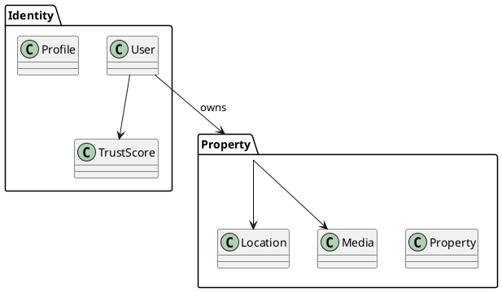
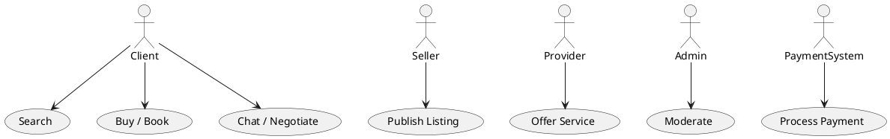
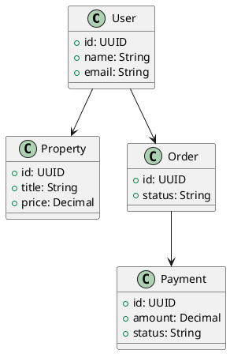
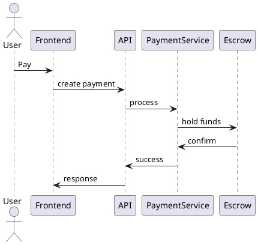
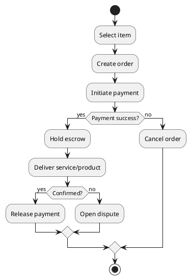

# DOMAURA — UML & Architecture (Phases 1 to 5)

## 1. DOMAIN MODEL (DDD)

### Bounded Contexts
- Identity & Access
- Property (PropTech)
- Marketplace
- Services
- Payments & Escrow
- Trust & Safety
- Communication
- AI Context

### Diagram (PlantUML)

---

## 2. USE CASE DIAGRAM

---

## 3. CLASS DIAGRAM

---

## 4. SEQUENCE DIAGRAM (Escrow Payment)

---

## 5. ACTIVITY DIAGRAM (Transaction Flow)

---

# END OF DOCUMENT
